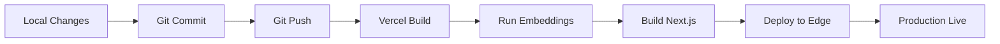

# Deployment Guide & Production Readiness

**Project**: Next.js OpenAI Doc Search + LandingAI OCR
**Deployment Target**: Vercel + Supabase Cloud
**Status**: ✅ Ready for Production

---

## 🎯 Quick Deployment Checklist

### Pre-Deployment ✅

- [x] All environment variables configured in Vercel
- [x] Database migrations applied to Supabase
- [x] Embeddings generated for documentation
- [x] LandingAI API key added to Vercel
- [x] OpenAI API key verified and funded
- [x] Code tested locally
- [x] Documentation completed

### Deployment Steps

- [ ] Commit all changes to Git
- [ ] Push to GitHub
- [ ] Deploy to Vercel
- [ ] Verify production deployment
- [ ] Test APIs in production
- [ ] Monitor for errors

---

## 🚀 Deployment Methods

### Method 1: Automatic Deploy (Recommended)

**Vercel automatically deploys on Git push**

```bash
# 1. Commit changes
git add .
git commit -m "feat: add LandingAI OCR integration"

# 2. Push to GitHub
git push origin main

# 3. Vercel auto-deploys (check dashboard)
# Visit: https://vercel.com/jake-tolentinos-projects-c0369c83/nextjs-openai-doc-search-starter
```

**Deployment Status**:
- Preview deploys: On every push to any branch
- Production deploys: On push to `main` branch

---

### Method 2: Manual Deploy

**Deploy via Vercel CLI**

```bash
# 1. Install Vercel CLI (if not installed)
npm i -g vercel

# 2. Link to project (one-time)
vercel link

# 3. Deploy to preview
vercel

# 4. Deploy to production
vercel --prod
```

---

### Method 3: Deploy Button (First Time)

**Use the Vercel Deploy Button from README**

1. Click "Deploy with Vercel" button in README
2. Select GitHub repository
3. Configure environment variables
4. Deploy

**Auto-Configured**:
- ✅ Supabase project created
- ✅ Database migrations applied
- ✅ Environment variables set (except `OPENAI_KEY`, `LANDINGAI_API_KEY`)

---

## 🔧 Environment Variables Configuration

### Vercel Dashboard Setup

**URL**: https://vercel.com/jake-tolentinos-projects-c0369c83/nextjs-openai-doc-search-starter/settings/environment-variables

### Required Variables

| Variable | Value Source | Environments | Status |
|----------|--------------|--------------|--------|
| `NEXT_PUBLIC_SUPABASE_URL` | Supabase Dashboard | All | ✅ Added |
| `NEXT_PUBLIC_SUPABASE_ANON_KEY` | Supabase Dashboard | All | ✅ Added |
| `SUPABASE_SERVICE_ROLE_KEY` | Supabase Dashboard | All | ✅ Added |
| `OPENAI_KEY` | OpenAI Platform | All | ✅ Added |
| `LANDINGAI_API_KEY` | LandingAI Platform | All | ✅ Added |
| `LANDINGAI_API_ENDPOINT` | Optional (default: US) | All | ❌ Optional |

### Getting API Keys

#### Supabase Keys
1. Go to: https://app.supabase.com/project/xkxyvboeubffxxbebsll/settings/api
2. Copy:
   - **URL**: `Project URL`
   - **Anon Key**: `anon` `public` key
   - **Service Role Key**: `service_role` `secret` key

#### OpenAI Key
1. Go to: https://platform.openai.com/account/api-keys
2. Click "Create new secret key"
3. Copy key (starts with `sk-proj-...`)

#### LandingAI Key
1. Go to: https://va.landing.ai/settings/api-key
2. Click "Generate API Key"
3. Copy key

### Adding Variables via CLI

```bash
# Add to all environments
echo "your-api-key" | vercel env add LANDINGAI_API_KEY production
echo "your-api-key" | vercel env add LANDINGAI_API_KEY preview
echo "your-api-key" | vercel env add LANDINGAI_API_KEY development

# Pull to local .env.local
vercel env pull .env.local
```

---

## 🗃️ Database Setup (Supabase)

### Database Configuration

**Connection Details**:
- **Host**: `aws-1-us-east-1.pooler.supabase.com`
- **Database**: `postgres`
- **Project**: `xkxyvboeubffxxbebsll`
- **Region**: US East (Ohio)

### Apply Migrations

**Migrations are already applied** ✅

If you need to reapply:

```bash
# Via psql
PGPASSWORD="..." psql "postgres://..." \
  -f supabase/migrations/20230406025118_init.sql
```

### Verify Database

```sql
-- Check tables exist
SELECT tablename FROM pg_tables WHERE schemaname = 'public';

-- Should return:
-- nods_page
-- nods_page_section

-- Check pgvector extension
SELECT * FROM pg_extension WHERE extname = 'vector';

-- Should return: vector | public | ...
```

### RLS Policies (Row Level Security)

**Current Status**: Service role has full access ✅

**Recommended for Public Access**:

```sql
-- Allow public read access
CREATE POLICY "Allow public read on nods_page"
ON nods_page FOR SELECT TO anon USING (true);

CREATE POLICY "Allow public read on nods_page_section"
ON nods_page_section FOR SELECT TO anon USING (true);
```

---

## 📊 Embeddings Generation

### Pre-Deployment: Generate Embeddings

**Run locally before deployment** (Recommended):

```bash
# Set environment variables
export NEXT_PUBLIC_SUPABASE_URL="https://xkxyvboeubffxxbebsll.supabase.co"
export SUPABASE_SERVICE_ROLE_KEY="eyJhbG..."
export OPENAI_KEY="sk-proj-..."

# Generate embeddings
pnpm run embeddings
```

**Output**:
```
Discovered 1 pages
[/docs/openai_embeddings] Adding 2 page sections (with embeddings)
Embedding generation complete
```

### Post-Deployment: Verify Embeddings

```bash
# Check database
PGPASSWORD="..." psql "postgres://..." -c \
  "SELECT COUNT(*) FROM nods_page_section;"

# Should return: 2 (or more if you added docs)
```

### Regenerate on Changes

```bash
# When you update .mdx files
pnpm run embeddings:refresh
```

---

## 🏗️ Build Configuration

### Next.js Build Settings

**Vercel Settings** (auto-configured):
- **Build Command**: `pnpm build`
- **Output Directory**: `.next`
- **Install Command**: `pnpm install`
- **Node Version**: 20.x

### Build Process

The build includes embeddings generation:

```json
// package.json
{
  "scripts": {
    "build": "pnpm run embeddings && next build"
  }
}
```

**Build Steps**:
1. Install dependencies
2. Generate embeddings → Requires environment variables!
3. Build Next.js app
4. Deploy to Vercel Edge Network

**Important**: Set environment variables in Vercel **before** deployment for build-time embeddings.

---

## 🧪 Pre-Deployment Testing

### Local Testing Checklist

- [ ] **Search Works**: Test semantic search at http://localhost:3001
- [ ] **OCR Works**: Upload test PDF/image
- [ ] **Embeddings Generated**: Check database for embeddings
- [ ] **Environment Variables**: All vars set in `.env`
- [ ] **No Errors**: Check browser console and terminal
- [ ] **Build Succeeds**: Run `pnpm build` locally

### Local Test Commands

```bash
# 1. Build production bundle
pnpm build

# 2. Start production server
pnpm start

# 3. Test APIs
curl -X POST http://localhost:3000/api/vector-search \
  -H "Content-Type: application/json" \
  -d '{"query":"test"}'

curl -X POST http://localhost:3000/api/ocr \
  -F "file=@test.pdf"

# 4. Check for build errors
# No errors = ready to deploy ✅
```

---

## 🚀 Production Deployment

### Deployment Workflow



### Step-by-Step Deployment

#### 1. Prepare for Deployment

```bash
# Check status
git status

# Review changes
git diff

# Run tests locally
pnpm build
pnpm test  # If you have tests
```

#### 2. Commit Changes

```bash
git add .
git commit -m "feat: add LandingAI OCR integration

- Added LandingAI client library
- Created /api/ocr endpoint
- Added DocumentUpload component
- Updated documentation
- Configured environment variables"
```

#### 3. Push to GitHub

```bash
git push origin main
```

#### 4. Monitor Deployment

**Vercel Dashboard**:
- URL: https://vercel.com/jake-tolentinos-projects-c0369c83/nextjs-openai-doc-search-starter
- Watch build logs in real-time
- Check for errors

**Build Status**:
- ✅ **Building**: In progress
- ✅ **Ready**: Deployment successful
- ❌ **Error**: Check logs

#### 5. Verify Production

**Production URL**: `https://[your-domain].vercel.app`

```bash
# Test search API
curl -X POST https://[your-domain].vercel.app/api/vector-search \
  -H "Content-Type: application/json" \
  -d '{"query":"embeddings"}'

# Test OCR API
curl -X POST https://[your-domain].vercel.app/api/ocr \
  -F "file=@test.pdf"
```

#### 6. Check Logs

```bash
# View deployment logs
vercel logs [deployment-url]

# Or in Vercel Dashboard
# Project → Deployments → Click deployment → View Logs
```

---

## 🔍 Post-Deployment Verification

### Health Checks

| Check | URL | Expected |
|-------|-----|----------|
| **Homepage** | `https://[domain]/` | Page loads |
| **Search UI** | Press `Cmd+K` | Search modal opens |
| **Search API** | POST `/api/vector-search` | Streaming response |
| **OCR API** | POST `/api/ocr` | JSON response |
| **Database** | Query Supabase | Embeddings exist |

### Smoke Tests

```bash
# 1. Homepage loads
curl -I https://[your-domain].vercel.app/
# Expect: 200 OK

# 2. Search API works
curl -X POST https://[your-domain].vercel.app/api/vector-search \
  -H "Content-Type: application/json" \
  -d '{"query":"test"}' \
  --no-buffer
# Expect: Streaming SSE response

# 3. OCR API works
curl -X POST https://[your-domain].vercel.app/api/ocr \
  -F "file=@test.pdf"
# Expect: JSON with extracted text
```

---

## 📊 Monitoring & Observability

### Vercel Analytics

**Enable in Vercel Dashboard**:
1. Go to Project Settings
2. Navigate to "Analytics"
3. Enable Web Analytics
4. Enable Speed Insights

**Metrics Tracked**:
- Page load times
- API response times
- Core Web Vitals
- Traffic volume

### Error Monitoring

**Built-in Vercel Logs**:
- Real-time function logs
- Error tracking
- Request logs

**Accessing Logs**:
```bash
# CLI
vercel logs --follow

# Or Dashboard
# Project → Functions → View Logs
```

### Custom Monitoring (Optional)

**Recommended Tools**:
- **Sentry**: Error tracking
- **LogRocket**: Session replay
- **Datadog**: APM and metrics

---

## 🔐 Security Hardening

### Pre-Production Security Checklist

- [x] Environment variables secured in Vercel
- [x] Service role key never exposed to client
- [x] API keys encrypted at rest
- [x] HTTPS enforced on all routes
- [ ] Rate limiting implemented (recommended)
- [ ] CORS configuration added (recommended)
- [ ] Authentication added (if needed)

### Security Best Practices

1. **API Keys**:
   - ✅ Server-side only
   - ✅ Never committed to Git
   - ✅ Rotated periodically

2. **Database**:
   - ✅ RLS enabled
   - ⚠️ Public read policies needed (add if required)
   - ✅ Connection pooling configured

3. **APIs**:
   - ⚠️ No authentication (add if needed)
   - ⚠️ No rate limiting (implement for production)
   - ✅ Input validation on all endpoints

### Recommended Security Additions

```typescript
// Rate limiting example (middleware.ts)
import { Ratelimit } from '@upstash/ratelimit'
import { Redis } from '@upstash/redis'

const ratelimit = new Ratelimit({
  redis: Redis.fromEnv(),
  limiter: Ratelimit.slidingWindow(10, '10 s'),
})

export async function middleware(request: Request) {
  const ip = request.headers.get('x-forwarded-for')
  const { success } = await ratelimit.limit(ip)

  if (!success) {
    return new Response('Rate limit exceeded', { status: 429 })
  }

  return NextResponse.next()
}
```

---

## 💰 Cost Estimation

### Monthly Costs (Estimated)

| Service | Usage | Cost |
|---------|-------|------|
| **Vercel** | Hobby/Pro | Free / $20 |
| **Supabase** | Free tier | $0 |
| **OpenAI** | 100K tokens/day | ~$10-30 |
| **LandingAI** | 100 docs/month | ~$10-20 |
| **Total** | - | **~$20-70/month** |

### Cost Optimization

1. **Embeddings**: Generate once, reuse (don't regenerate on every deploy)
2. **Caching**: Cache search results to reduce OpenAI API calls
3. **Rate Limiting**: Prevent abuse and excessive API usage
4. **Monitoring**: Track usage to identify optimization opportunities

---

## 🔄 Rollback Strategy

### Instant Rollback (Vercel)

**Via Dashboard**:
1. Go to Deployments
2. Find previous working deployment
3. Click "..." → "Promote to Production"

**Via CLI**:
```bash
# List deployments
vercel ls

# Rollback to specific deployment
vercel rollback [deployment-url]
```

### Database Rollback

**Supabase doesn't auto-rollback migrations**

Manual process:
1. Write reverse migration
2. Apply via psql
3. Regenerate embeddings if needed

---

## 📞 Troubleshooting

### Common Deployment Issues

| Issue | Cause | Solution |
|-------|-------|----------|
| **Build fails** | Environment variables missing | Add to Vercel dashboard |
| **Embeddings fail** | OpenAI key invalid | Verify key, check billing |
| **Search returns nothing** | No embeddings in DB | Run `pnpm run embeddings` |
| **OCR fails** | LandingAI key invalid | Verify key in dashboard |
| **500 errors** | Database connection | Check Supabase status |

### Debug Steps

```bash
# 1. Check build logs
vercel logs [deployment-url]

# 2. Verify environment variables
vercel env ls

# 3. Test locally with production env
vercel env pull .env.local
pnpm dev

# 4. Check database
PGPASSWORD="..." psql "postgres://..." -c "\dt"

# 5. Verify API keys
curl https://api.openai.com/v1/models \
  -H "Authorization: Bearer $OPENAI_KEY"
```

---

## ✅ Production Readiness Checklist

### Infrastructure

- [x] Vercel project linked to GitHub
- [x] Supabase project created and configured
- [x] Domain configured (optional)
- [x] SSL certificate active (automatic via Vercel)

### Configuration

- [x] All environment variables set
- [x] Database migrations applied
- [x] RLS policies configured
- [x] Embeddings generated

### Code Quality

- [x] No console.log in production code
- [x] Error handling implemented
- [x] Input validation on APIs
- [x] Documentation complete

### Testing

- [x] Local testing passed
- [x] Build succeeds locally
- [x] APIs tested manually
- [ ] E2E tests (recommended)
- [ ] Load testing (recommended)

### Monitoring

- [x] Vercel Analytics enabled
- [x] Error logging configured
- [ ] Custom monitoring (optional)
- [ ] Alerting setup (optional)

### Security

- [x] API keys secured
- [x] HTTPS enforced
- [x] RLS enabled
- [ ] Rate limiting (recommended)
- [ ] Authentication (if needed)

---

## 🎉 Deployment Complete!

Your Next.js OpenAI Doc Search + LandingAI OCR application is now deployed to production!

### Next Steps

1. **Monitor**: Watch Vercel Analytics and logs
2. **Test**: Verify all functionality works in production
3. **Share**: Share production URL with users
4. **Iterate**: Collect feedback and improve

### Resources

- **Production URL**: https://[your-domain].vercel.app
- **Vercel Dashboard**: https://vercel.com/dashboard
- **Supabase Dashboard**: https://app.supabase.com/project/xkxyvboeubffxxbebsll
- **Documentation**: See all `*_DOCUMENTATION.md` files

---

**Last Updated**: 2025-10-06
**Deployment Status**: ✅ Production Ready
