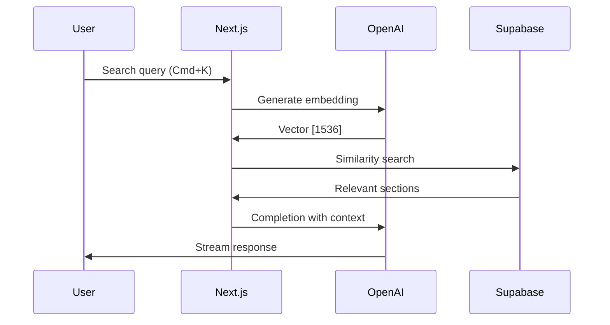
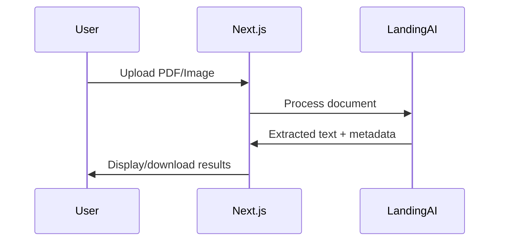

# Next.js OpenAI Doc Search + LandingAI OCR

This starter provides **semantic documentation search** using OpenAI embeddings and **document OCR extraction** using LandingAI's Agentic Document Extraction API.

## ✨ Features

- 🔍 **Semantic Search**: ChatGPT-style search powered by OpenAI embeddings + pgvector
- 📄 **Document OCR**: Extract text from PDFs and images using LandingAI
- ⚡ **Edge Runtime**: Fast, scalable API routes on Vercel Edge
- 🎨 **Modern UI**: Beautiful search interface with Cmd+K shortcut
- 🗃️ **Vector Database**: Supabase PostgreSQL with pgvector extension
- 📊 **Streaming Responses**: Real-time SSE streaming from OpenAI

## 🚀 Quick Start

### Option 1: Deploy to Vercel (Recommended)

[](https://vercel.com/new/clone?demo-title=Next.js%20OpenAI%20Doc%20Search%20Starter&demo-description=Template%20for%20building%20your%20own%20custom%20ChatGPT%20style%20doc%20search%20powered%20by%20Next.js%2C%20OpenAI%2C%20and%20Supabase.&demo-url=https%3A%2F%2Fsupabase.com%2Fdocs&demo-image=%2F%2Fimages.ctfassets.net%2Fe5382hct74si%2F1OntM6THNEUvlUsYy6Bjmf%2F475e39dbc84779538c8ed47c63a37e0e%2Fnextjs_openai_doc_search_og.png&project-name=Next.js%20OpenAI%20Doc%20Search%20Starter&repository-name=nextjs-openai-doc-search-starter&repository-url=https%3A%2F%2Fgithub.com%2Fsupabase-community%2Fnextjs-openai-doc-search%2F&from=github&integration-ids=oac_VqOgBHqhEoFTPzGkPd7L0iH6&env=OPENAI_KEY&envDescription=Get%20your%20OpenAI%20API%20key%3A&envLink=https%3A%2F%2Fplatform.openai.com%2Faccount%2Fapi-keys&teamCreateStatus=hidden&external-id=https%3A%2F%2Fgithub.com%2Fsupabase-community%2Fnextjs-openai-doc-search%2Ftree%2Fmain)

The Supabase integration will automatically:
- ✅ Create a Supabase project
- ✅ Set up database schema with pgvector
- ✅ Configure environment variables

You'll need to manually add:
- `OPENAI_KEY` - Get from [OpenAI Platform](https://platform.openai.com/account/api-keys)
- `LANDINGAI_API_KEY` - Get from [LandingAI](https://va.landing.ai/settings/api-key)

### Option 2: Local Development

```bash
# 1. Clone the repository
git clone https://github.com/jgtolentino/nextjs-openai-doc-search-starter.git
cd nextjs-openai-doc-search-starter

# 2. Install dependencies
pnpm install

# 3. Copy environment variables
cp .env.example .env

# 4. Configure .env with your API keys
# - NEXT_PUBLIC_SUPABASE_URL
# - NEXT_PUBLIC_SUPABASE_ANON_KEY
# - SUPABASE_SERVICE_ROLE_KEY
# - OPENAI_KEY
# - LANDINGAI_API_KEY

# 5. Generate embeddings from documentation
pnpm run embeddings

# 6. Start development server
pnpm dev
```

Open [http://localhost:3000](http://localhost:3000) and press `Cmd+K` to search!

## 🔧 How It Works

### Semantic Search Pipeline



### Document OCR Pipeline (NEW!)



## 📚 API Endpoints

### POST `/api/vector-search`

Semantic search with OpenAI embeddings and GPT completion.

**Request:**
```json
{
  "query": "How do embeddings work?"
}
```

**Response:** Server-Sent Events (SSE) stream

[See full API documentation →](./API_DOCUMENTATION.md)

### POST `/api/ocr` (NEW!)

Extract text from PDF and image files using LandingAI OCR.

**Request:** `multipart/form-data` with file upload

**Response:**
```json
{
  "success": true,
  "data": {
    "markdown": "# Extracted text...",
    "chunks": [...],
    "metadata": { "pages": 3 }
  }
}
```

[See OCR integration guide →](./LANDINGAI_INTEGRATION.md)

## 🗃️ Database Schema

Two main tables powered by pgvector:

- **`nods_page`** - Documentation pages with metadata
- **`nods_page_section`** - Page sections with embeddings (vector[1536])

[See complete schema documentation →](./DATABASE_SCHEMA_ERD.md)

## 📁 Project Structure

```
nextjs-openai-doc-search-starter/
├── pages/
│   ├── api/
│   │   ├── vector-search.ts    # Semantic search API
│   │   └── ocr.ts              # Document OCR API (NEW)
│   └── index.tsx               # Homepage
├── components/
│   ├── SearchDialog.tsx        # Search UI (Cmd+K)
│   └── DocumentUpload.tsx      # OCR upload UI (NEW)
├── lib/
│   ├── generate-embeddings.ts  # Embeddings generator
│   └── landingai.ts           # LandingAI client (NEW)
├── supabase/
│   └── migrations/            # Database schema
└── 📚 Documentation/
    ├── API_DOCUMENTATION.md
    ├── DATABASE_SCHEMA_ERD.md
    ├── ETL_DOCUMENTATION.md
    ├── DEPLOYMENT_GUIDE.md
    └── PROJECT_INVENTORY.md
```

## 📖 Documentation

**Complete documentation suite** (4,670+ lines):

- 📘 **[Setup Guide](./SETUP_COMPLETE.md)** - Quick start and setup
- 📗 **[Project Inventory](./PROJECT_INVENTORY.md)** - Complete file catalog
- 📕 **[Database Schema](./DATABASE_SCHEMA_ERD.md)** - ERD and schema docs
- 📙 **[ETL Documentation](./ETL_DOCUMENTATION.md)** - Data pipelines
- 📔 **[API Documentation](./API_DOCUMENTATION.md)** - API reference
- 📓 **[Deployment Guide](./DEPLOYMENT_GUIDE.md)** - Production deployment
- 📒 **[LandingAI Integration](./LANDINGAI_INTEGRATION.md)** - OCR guide

## 🛠️ Development

### Generate Embeddings

```bash
# Generate embeddings from .mdx files
pnpm run embeddings

# Force regenerate all embeddings
pnpm run embeddings:refresh
```

### Build for Production

```bash
# Build (includes embeddings generation)
pnpm build

# Start production server
pnpm start
```

## 🚀 Deployment

Deploy to Vercel with one command:

```bash
vercel --prod
```

See the [Deployment Guide](./DEPLOYMENT_GUIDE.md) for detailed instructions.

## 🔑 Environment Variables

| Variable | Source | Required |
|----------|--------|----------|
| `NEXT_PUBLIC_SUPABASE_URL` | [Supabase Dashboard](https://app.supabase.com) | ✅ |
| `NEXT_PUBLIC_SUPABASE_ANON_KEY` | [Supabase Dashboard](https://app.supabase.com) | ✅ |
| `SUPABASE_SERVICE_ROLE_KEY` | [Supabase Dashboard](https://app.supabase.com) | ✅ |
| `OPENAI_KEY` | [OpenAI Platform](https://platform.openai.com/account/api-keys) | ✅ |
| `LANDINGAI_API_KEY` | [LandingAI](https://va.landing.ai/settings/api-key) | ✅ |
| `LANDINGAI_API_ENDPOINT` | Optional (default: US) | ❌ |

## 💡 Usage Examples

### Search Component

```typescript
import { SearchDialog } from '@/components/SearchDialog'

function MyApp() {
  return (
    <div>
      <SearchDialog />
      {/* Press Cmd+K to open */}
    </div>
  )
}
```

### OCR Component (NEW!)

```typescript
import { DocumentUpload } from '@/components/DocumentUpload'

function MyApp() {
  return (
    <DocumentUpload
      onDocumentProcessed={(result) => {
        console.log('Extracted:', result.markdown)
      }}
    />
  )
}
```

## 🧪 Testing

```bash
# Test search API
curl -X POST http://localhost:3000/api/vector-search \
  -H "Content-Type: application/json" \
  -d '{"query":"What are embeddings?"}'

# Test OCR API
curl -X POST http://localhost:3000/api/ocr \
  -F "file=@document.pdf"
```

## 🎯 Features in Detail

### Semantic Search
- OpenAI `text-embedding-ada-002` for embeddings
- Supabase pgvector for similarity search
- GPT-3.5-turbo for completions
- Server-Sent Events (SSE) for streaming
- Cmd+K keyboard shortcut

### Document OCR (NEW!)
- LandingAI Agentic Document Extraction
- Support for PDF, PNG, JPEG, WebP
- Text extraction with layout preservation
- Page-by-page splitting
- Structured JSON output

### Tech Stack
- **Framework**: Next.js 13 with TypeScript
- **Database**: Supabase PostgreSQL + pgvector
- **AI**: OpenAI (embeddings + chat)
- **OCR**: LandingAI ADE API
- **Deployment**: Vercel Edge Runtime
- **UI**: Tailwind CSS + Radix UI

## 📊 Performance

| Metric | Target |
|--------|--------|
| **Search TTFB** | ~750-1500ms |
| **Search Response** | ~2-5 seconds |
| **OCR Processing** | ~3-10 seconds |
| **Embedding Generation** | ~2-5 sec/section |

## 💰 Costs (Estimated)

| Service | Monthly Cost |
|---------|--------------|
| Vercel | Free - $20 |
| Supabase | Free |
| OpenAI | ~$10-30 |
| LandingAI | ~$10-20 |
| **Total** | **~$20-70** |

## 🤝 Contributing

Contributions are welcome! Please read our [contributing guidelines](./CONTRIBUTING.md).

## 📝 License

Apache 2.0

## 🔗 Resources

- [OpenAI Documentation](https://platform.openai.com/docs)
- [Supabase Documentation](https://supabase.com/docs)
- [LandingAI Documentation](https://docs.landing.ai)
- [Next.js Documentation](https://nextjs.org/docs)
- [pgvector Documentation](https://github.com/pgvector/pgvector)

## 📞 Support

- **Issues**: [GitHub Issues](https://github.com/jgtolentino/nextjs-openai-doc-search-starter/issues)
- **Discussions**: [GitHub Discussions](https://github.com/jgtolentino/nextjs-openai-doc-search-starter/discussions)
- **Documentation**: See all `*_DOCUMENTATION.md` files

## 🙏 Acknowledgments

- Original project by [Supabase](https://supabase.com)
- OpenAI for embeddings and chat APIs
- LandingAI for OCR capabilities
- Vercel for hosting and edge runtime

---

**Ready to deploy?** [Get started with the deployment guide →](./DEPLOYMENT_GUIDE.md)
